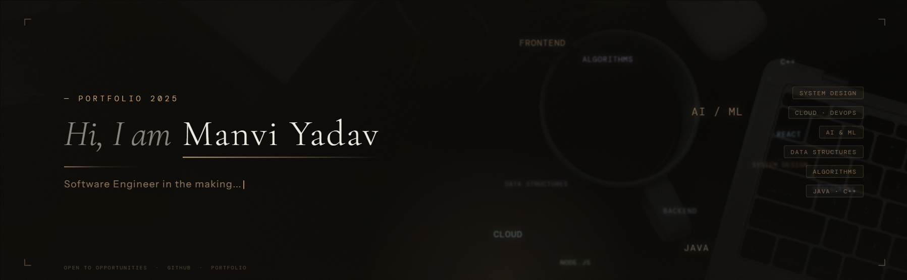

# 👋 Hello, My Name is Manvi Yadav  


Welcome to my GitHub profile!  
I’m passionate about building scalable, impactful solutions and exploring the world of software engineering 🚀

## 👨🏻‍💻  A Little Bit About Me and My Interests  
```yaml
name: Manvi Yadav  
located_in: India  
current_job: Software Developer  
education:  
     - 3rd Year, Bachelor's in Computer Science — SRM University  


fields_of_interests:  
  - Web Development  
  - Machine Learning  
  - Data Science  
  - UI/UX Design  
  - DevOps  
  - Open Source  

technical_background:  
  - Full Stack Developer  
  - Contributor in Girlscript Summer of Code & Hacktoberfest  
  - Competitive Programmer  
  - Intern - Software Development  

currently_learning:  
  - Docker, React, and Next.js  

2025 Goals:  
  - Build impactful projects and contribute more to open source  
  - Learn new technologies and frameworks  

hobbies:  
  - Coding  
  - Reading Tech Blogs  
  - Music  
  - Design
```


<!--
**Manvi0408/Manvi0408** is a ✨ _special_ ✨ repository because its `README.md` (this file) appears on your GitHub profile.

Here are some ideas to get you started:

- 🔭 I’m currently working on ...
- 🌱 I’m currently learning ...
- 👯 I’m looking to collaborate on ...
- 🤔 I’m looking for help with ...
- 💬 Ask me about ...
- 📫 How to reach me: ...
- 😄 Pronouns: ...
- ⚡ Fun fact: ...
--> 


 </div>


<div align="center">
  
</div>


<h2> 🚀 &nbsp;Some Tools I Have Used and Learned</h2>
<p align="left">


 


  


    

 


</p>
<div align="center">
  <div style="
    width: 90%;
    height: 5px;
    background: #a855f7;
    box-shadow: 0 0 15px 3px #a855f7;
    border-radius: 10px;
    margin-top: 20px;
  "></div>
</div>


[](https://git.io/streak-stats)
